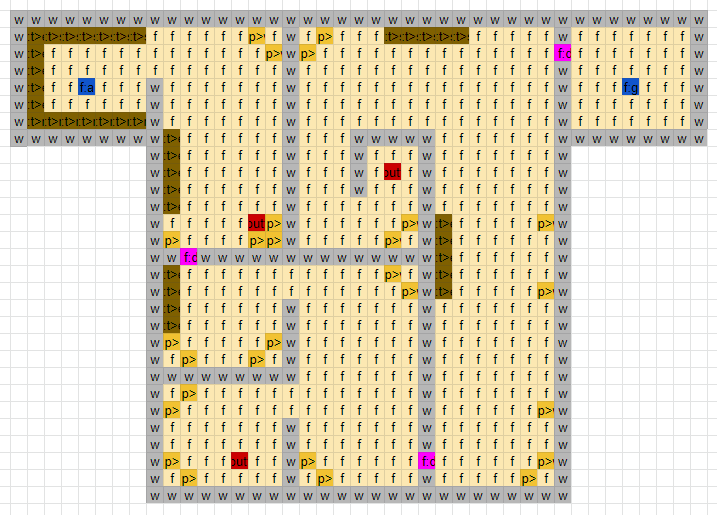

# __Defining a level__

Levels in the AIGym are specified using comma-seperated *.csv* files. These can be generated from any spreadsheet program. In this folder you will find some example levels. 



## Specification

A level is meant to specify the locations of grid objects with optional parameters and an interaction table that specifies relations between objects. 

Eeach segment (interaction table, individual floors) of the level file should be made on its own page/sheet. TODO: how to convert multi-sheet into one csv? This corresponds with the distance between two sheets. 

#### Interaction table
The first sheet should specifiy the interaction table. The interaction table specifies for each sensor, which actuators are activated when it is pressed. A new line first specifies the sensor, followed by any number of actuators:

```
[sensor1], [actuator1], [actuator2], ...
[sensor2], [actuator2], [actuator4], ...
```

@Todo: perhaps we can seperate these two things because semantically they are very different.
Furthermore, it also specifies a table for NPC walk patterns.

```
[npc1], [g1], [g2], ...
[npc2], [g4], [g3], ...
```

### Floors

A grid cell can contain multiple objects, each with multiple optional parameters. Below is a list of all object symbols that can be interpreted as objects.

| Symbol | Placeable | 
| :---   |    :----: |
| w      | Wall      |
| f      | Floor     |
| a      | Character |
| d      | Door      |
| t      | Table     |
| p      | Furniture |
| npc    | NPC       |

An object definition should be immediately followed by the following parameters:


@Todo: order, should ID be last or first?

| Seperator |    Values    | Description  | 
| :---      |    :----:    | :---         |
|  ^        | Alphanumeric | Must be unique, agentID should be an integer |
|  >        | {n,e,s,w}    | Rotation     |
|  #        |    rgb       | Hexadecimal Color, optional transparency value |

Parameters are parsed in order from the end backwards.